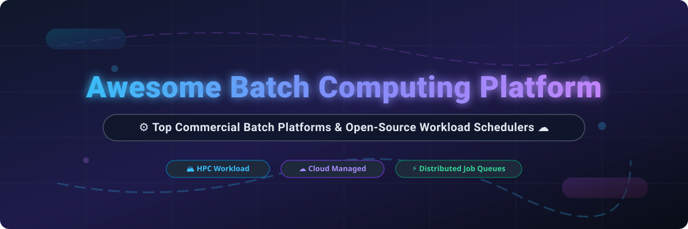

# Awesome-Batch-Computing-Platform

# Awesome-Batch-Computing-Platform ⚙️ ☁️



  





  
  
  
  
  
  



---

## 🌟 Top Batch Computing Platform Ecosystem

**Curated List of Commercial Batch Scheduling Platforms & Open-Source Job Orchestration Tools**  
*Focused on HPC Workload Managers, Cloud Batch Services, Pipeline Orchestration & Self-Hosted Job Schedulers*  

**Last updated: October 2026** 📅

---

### 📌 Overview & SEO Summary
Welcome to the ultimate curated directory of **batch computing platforms**, **HPC workload managers**, and **open-source job scheduling frameworks**. Whether you are looking for enterprise-grade commercial solutions (such as *IBM Spectrum LSF*, *Rescale*, and *Domino Data Lab*), or self-hostable open-source alternatives (like *Slurm*, *Armada*, and *Nextflow*), this list covers category leaders, cloud-native batch services, and privacy-respecting job orchestration stacks.

---

## 📑 Table of Contents
- [🏢 SaaS & Commercial Platforms](#-saas--commercial-platforms)
- [🔓 Open-Source GitHub Projects](#-open-source-github-projects)
- [🛠️ How to Contribute](#%EF%B8%8F-how-to-contribute)
- [📊 Star History](#-star-history)
- [🤝 Support & Sponsorship](#-support--sponsorship)
- [⚠️ Disclaimer](#%EF%B8%8F-disclaimer)

---

## 🏢 SaaS / Commercial Platforms

The batch computing market spans cloud-native managed services and enterprise HPC schedulers. Cloud providers (AWS, Google, Azure) offer **free batch orchestration services** — you pay only for the underlying compute, storage, and networking resources consumed . Enterprise schedulers like IBM Spectrum LSF use per-install and per-resource licensing, while platforms like Rescale and Domino bundle infrastructure management, software catalogs, and compliance into subscription pricing .

| SaaS / Commercial Platform | Company / Owner | Valuation / Market Cap | Standard Edition Starting Price | Free Tier / Free Trial Limits | Description |
| :--- | :--- | :--- | :--- | :--- | :--- |
| **[AWS Batch](https://aws.amazon.com/batch/)** ☁️ | Amazon | ~$2.0 Trillion | **Free service**; pay for underlying EC2, Fargate, and storage | No platform fee; pay-as-you-go | **Cloud-native batch computing** — Fully managed service that dynamically provisions optimal compute resources. Supports EC2 Spot, Reserved Instances, and Fargate. Queues, job definitions, and compute environments . |
| **[Google Cloud Batch](https://cloud.google.com/batch)** 🌐 | Google (Alphabet) | ~$2.0 Trillion | **Free service**; pay for Compute Engine, GPUs, and persistent disks | No platform fee; $300 free credits for new customers | **Serverless batch processing** — Automatically provisions and scales compute resources. Spot VM support can cut costs up to 91%. Auto-labels resources for cost tracking . |
| **[Azure Batch](https://azure.microsoft.com/en-us/services/batch/)** 🔷 | Microsoft | ~$3.90 Trillion | **Free service**; pay for VMs, storage, and networking | No platform fee; pay-as-you-go | **Azure-native batch processing** — Runs large-scale parallel and HPC jobs. Pool-based compute management with automatic scaling. Integrates with Azure Storage, Data Factory, and Monitor . |
| **[IBM Spectrum LSF](https://www.ibm.com/products/spectrum-lsf)** 🏢 | IBM | ~$200 Billion | **$30,347.36** (RTM Server Install, 12-month subscription); License Scheduler: $97.63/resource value unit  | No free tier; trial available | **Enterprise HPC workload manager** — The gold standard for on-premises HPC. Job scheduling, resource management, and policy enforcement. Used in genomics, EDA, and financial services. |
| **[Rescale](https://rescale.com/)** 🚀 | Rescale | Private | Custom enterprise quote | **Free trial available** | **Turnkey HPC and AI platform** — 1,250+ pre-installed engineering software packages. Multi-cloud orchestration. Commitment Plans reduce costs 10-60%. SOC 2, FedRAMP, ITAR, HIPAA compliant . |
| **[Slurm Cloud (SchedMD)](https://www.schedmd.com/)** 🏔️ | SchedMD | Private | Custom enterprise support pricing | **Slurm OSS free forever** | **Commercial support for Slurm** — SchedMD provides enterprise support, training, and custom development for the world's most widely deployed HPC scheduler. |
| **[Domino Data Lab](https://domino.ai/)** 📊 | Domino Data Lab | Private | Custom enterprise subscription | No free tier; demo available | **Enterprise MLOps and batch compute** — Self-managed (VPC/on-prem) or Domino Cloud. Unlimited consumer licenses. FinOps add-on for cost monitoring. Nexus for hybrid/multicloud workloads . |
| **[Seqera Platform (Nextflow Tower)](https://seqera.io/)** 🧬 | Seqera Labs | Private | **$25,000/year** base + $5,900/user/year list price  | **Cloud Free tier available**; Cloud Pro custom quote | **Nextflow pipeline orchestration** — Launch, monitor, and manage Nextflow pipelines. Wave containers, Fusion virtual filesystem. Self-hosted Enterprise for GxP compliance . |
| **[Qubole](https://www.qubole.com/)** 🔥 | Qubole | Private | **~$0.17/QCU-hour** (usage-based); Business Edition free up to 30,000 QCPU/month  | **Business Edition free** (30,000 QCPU/month, Oracle Cloud only)  | **Cloud data platform with batch processing** — Apache Spark, Hive, Presto, and TensorFlow. Auto-scaling clusters. Business Edition on Oracle Cloud at no platform cost. |
| **[Dask Cloud (Coiled)](https://coiled.io/)** 🐍 | Coiled | Private | **Free for individuals** with modest use; paid tiers for teams  | **Free tier available** | **Managed Dask clusters** — Scale Python workloads in the cloud. Run on Kubernetes or Coiled SaaS. Processes data at ~$0.10/TiB . |

---

## 🔓 Open-Source GitHub Projects

*Sorted by GitHub_Stars_Count (Descending)* 🌟

- **[Slurm](https://github.com/SchedMD/slurm)**   
  **The world's most widely deployed HPC workload manager**, GPL-2.0 licensed. ~1k+ stars on GitHub mirror. Powers 60%+ of TOP500 supercomputers. Job scheduling, resource allocation, and queue management. Plugins for accounting, energy monitoring, and GPU management . SchedMD provides commercial support. 🏔️

- **[Armada](https://github.com/armadaproject/armada)**   
  **Kubernetes-native batch scheduling at scale**, Apache-2.0 licensed. ~500+ stars. **CNCF Sandbox project** used in production at G-Research. **Runs millions of jobs per day across tens of thousands of nodes**. Fair queuing based on dominant resource fairness. Gang-scheduling for atomic job sets. Job preemption. Multi-cluster scheduling . ⚓

- **[Nextflow](https://github.com/nextflow-io/nextflow)**   
  **Data-driven computational pipelines**, Apache-2.0 licensed. ~3k+ stars. **The de facto standard for bioinformatics pipelines**. Portable across cloud and on-prem. Container-native (Docker, Singularity). Reproducible, scalable, and auditable. Seqera Platform provides enterprise management . 🧬

- **[Dask](https://github.com/dask/dask)**   
  **Parallel computing with Python**, BSD-3-Clause licensed. ~13k+ stars. Scales NumPy, Pandas, and Scikit-learn workflows. Dask Distributed for cluster computing. Runs on Kubernetes, YARN, SLURM, and cloud services. Coiled provides managed SaaS . 🐍

- **[xqute](https://github.com/pwwang/xqute)**   
  **Job management system for Python**, MIT licensed. ~100+ stars. **Plugin-based scheduler adaptors** for SGE, Slurm, SSH, Google Batch, and containers (Docker/Podman/Apptainer). Async execution with configurable forks. Job retrying and pipeline halting on failure. Cloud working directory support . 🛠️

- **[Apache Airflow](https://github.com/apache/airflow)**   
  **Workflow orchestration platform**, Apache-2.0 licensed. ~40k+ stars. DAG-based pipeline scheduling. Operators for AWS Batch, Google Cloud Batch, and Azure Batch. The most widely adopted open-source workflow orchestrator. 🌊

- **[Kubeflow](https://github.com/kubeflow/kubeflow)**   
  **ML toolkit for Kubernetes**, Apache-2.0 licensed. ~14k+ stars. Kubeflow Pipelines for ML workflow orchestration. Training operators for distributed TensorFlow, PyTorch, and MPI. Katib for hyperparameter tuning. 🤖

- **[Apache Spark](https://github.com/apache/spark)**   
  **Unified analytics engine for large-scale data processing**, Apache-2.0 licensed. ~40k+ stars. Batch processing, streaming, SQL, ML, and graph processing. Runs on Kubernetes, YARN, and standalone clusters. The foundation for many batch data pipelines. ⚡

- **[Ray](https://github.com/ray-project/ray)**   
  **Distributed computing framework for AI and Python**, Apache-2.0 licensed. ~35k+ stars. Ray Tune for hyperparameter tuning. Ray Train for distributed training. Ray Serve for model serving. Scales from laptop to cluster. 🎯

- **[Temporal](https://github.com/temporalio/temporal)**   
  **Durable execution platform**, MIT licensed. ~15k+ stars. Workflow-as-code with automatic retries, timeouts, and state persistence. Used for batch orchestration and long-running processes. Guarantees exactly-once execution. ⏳

---

## 🛠️ How to Contribute

Contributions are welcome! Follow these steps to submit new batch computing platforms or open-source scheduling software:

1. 🍴 **Fork** the repository.
2. 📝 **Add/edit** entries in `README.md` maintaining table/list structure and formatting.
3. 🔗 Include project title, official website/GitHub link, exact Stars_Count, license, and brief description.
4. 🚀 Submit a **Pull Request** with a descriptive summary of your changes.

---

## 📊 Star History



---

## 🤝 Support & Sponsorship

If you find this batch computing platform repository useful, please consider supporting the project:

- ⭐ **Star** this repository to increase visibility!
- 🔀 **Fork** and share with fellow developers, HPC engineers, and data platform teams.
- ☕ **Sponsor & Buy Me a Coffee**: Support ongoing open-source curation via the [GitHub Sponsor Dashboard](https://github.com/sponsors/ishandutta2007).

---

## ⚠️ Disclaimer

- This is a **community-curated** list — not exhaustive and not an endorsement. ℹ️
- Cloud batch services (AWS, Google, Azure) are **free orchestration layers** — your actual costs come from the compute, storage, and networking resources consumed . **Monitor resource usage carefully**; batch jobs can accumulate significant charges if left running or misconfigured.
- Enterprise schedulers like IBM Spectrum LSF use per-install and per-resource licensing that can exceed **$30,000/year** for server installs alone . Open-source alternatives (Slurm, Armada, Nextflow) provide self-hosted ownership and transparency, but enterprise-grade SLA guarantees, professional support, and managed infrastructure remain primarily commercial offerings. ⚙️

---



  <b>Made with ❤️ for HPC engineers, data platform teams, and open-source batch computing advocates.</b>

